# Frontend Development Tutorial

## 📚 Complete React + TypeScript + Tailwind Course

Learn modern frontend development by building a real production chat interface. This tutorial series takes you from zero to a fully functional React application.

## 🎯 What You'll Build

A professional chat interface that:
- Renders markdown with syntax highlighting
- Persists conversations in local storage
- Adapts to dark/light mode
- Connects to an AI orchestrator backend
- Displays routing decisions and agent information

## 📖 Tutorial Chapters

### [1. Introduction](./01-introduction.md)
**Start Here!** Overview of the project, prerequisites, and learning path.
- What you'll learn
- Required tools and setup
- Project structure overview
- Key concepts to remember

### [2. Project Setup](./02-project-setup.md)
Setting up a modern React development environment from scratch.
- Creating a Vite project
- Understanding configuration files
- Installing dependencies
- File structure best practices

### [3. Understanding Components](./03-understanding-components.md)
Learn React's component-based architecture.
- What are components?
- JSX syntax and rules
- Props and component composition
- Event handling
- Our chat components explained

### [4. Styling with Tailwind](./04-styling-with-tailwind.md)
Master utility-first CSS with Tailwind.
- Tailwind philosophy
- Common utility classes
- Responsive design
- Dark mode implementation
- Our chat UI styles explained

### [5. TypeScript Basics](./05-typescript-basics.md)
Add type safety to your React code.
- Types vs interfaces
- Typing props and state
- Generic components
- Type inference
- Common patterns

### [6. State Management](./06-state-management.md)
Manage data and UI state effectively.
- useState hook deep dive
- useEffect and side effects
- Custom hooks
- Local storage integration
- Performance optimization

### [7. Building the Chat UI](./07-building-chat-ui.md)
Step-by-step implementation guide.
- Setting up the layout
- Creating message components
- Implementing the input field
- Adding markdown rendering
- Integrating all pieces

### [8. Troubleshooting Guide](./08-troubleshooting.md)
**Save This!** Solutions to common problems.
- Build and compilation errors
- Styling issues
- React problems
- TypeScript errors
- Quick fixes checklist

## 🚀 Quick Start

1. **New to React?** Start with [Chapter 1: Introduction](./01-introduction.md)
2. **Setting up?** Jump to [Chapter 2: Project Setup](./02-project-setup.md)
3. **Having issues?** Check [Chapter 8: Troubleshooting](./08-troubleshooting.md)

## 📁 Code Structure

The frontend code you're learning about:
```
frontend/
├── src/
│   ├── components/     # React components
│   │   └── Chat/       # Chat UI components
│   ├── types/          # TypeScript definitions
│   ├── App.tsx         # Main app
│   └── index.css       # Global styles
├── package.json        # Dependencies
└── vite.config.ts      # Build config
```

## 🎓 Learning Approach

This tutorial follows these principles:

1. **Learn by Doing** - Build a real application
2. **Understand the Why** - Not just how, but why
3. **Progressive Complexity** - Start simple, add features
4. **Modern Best Practices** - Industry-standard patterns

## 💡 Tips for Success

### If You're New to Frontend:
- Type out code instead of copying
- Experiment with changes
- Read error messages carefully
- Use the troubleshooting guide
- Take breaks when stuck

### If You're Experienced:
- Focus on React patterns
- Study the TypeScript usage
- Review the architecture decisions
- Check the troubleshooting guide for quick fixes

## 🛠️ Required Tools

Before starting, ensure you have:
- **Node.js 18+** installed
- **npm** (comes with Node.js)
- **Git** for version control
- **VS Code** (recommended editor)

Check your setup:
```bash
node --version  # Should be v18+
npm --version   # Should be v9+
git --version   # Any recent version
```

## 🔍 Key Files to Study

As you learn, pay special attention to these files:

1. **`ChatContainer.tsx`** - State management and component orchestration
2. **`Message.tsx`** - Markdown rendering and conditional styling
3. **`types/chat.ts`** - TypeScript interface definitions
4. **`index.css`** - Tailwind setup and global styles

## 📚 Additional Resources

### Official Documentation
- [React Documentation](https://react.dev)
- [TypeScript Handbook](https://www.typescriptlang.org/docs)
- [Tailwind CSS Docs](https://tailwindcss.com/docs)
- [Vite Guide](https://vitejs.dev/guide)

### Project Resources
- [Main Project README](../../../README.md)
- [Frontend Source Code](../../../frontend/)
- [API Documentation](../../orchestrator-implementation-plan.md)

## 🤝 Getting Help

### Quick Help:
1. Check the [Troubleshooting Guide](./08-troubleshooting.md)
2. Review the actual code in `frontend/src/`
3. Look for comments in the code

### Common Issues:
- **Tailwind not working?** See troubleshooting guide
- **TypeScript errors?** Check chapter 5 (coming soon)
- **State not updating?** Review chapter 6 (coming soon)

## 📈 Your Learning Path

```mermaid
graph LR
    A[1. Introduction] --> B[2. Setup]
    B --> C[3. Components]
    C --> D[4. Styling]
    D --> E[5. TypeScript]
    E --> F[6. State]
    F --> G[7. Build Chat]
    G --> H[🎉 Complete!]
    
    I[8. Troubleshooting] --> B
    I --> C
    I --> D
    I --> E
    I --> F
    I --> G
```



## ✅ Progress Checklist

Track your learning progress:

- [ ] Read Introduction
- [ ] Complete Project Setup
- [ ] Understand Components
- [ ] Master Tailwind Styling
- [ ] Learn TypeScript Basics
- [ ] Grasp State Management
- [ ] Build Complete Chat UI
- [ ] Can troubleshoot issues

## 🎯 What's Next?

After completing this tutorial, you'll be ready to:
1. Add new features to the chat interface
2. Integrate with the backend API (Phase 2)
3. Build your own React applications
4. Contribute to the project

## 📝 Notes

This tutorial is based on the actual Phase 1 implementation of the Agent Network Sandbox frontend. All code examples are from the working application.

---

**Ready to start?** → [Begin with Chapter 1: Introduction](./01-introduction.md)

**Having issues?** → [Jump to Troubleshooting](./08-troubleshooting.md)

---

*Last updated: Frontend Phase 1 Complete*