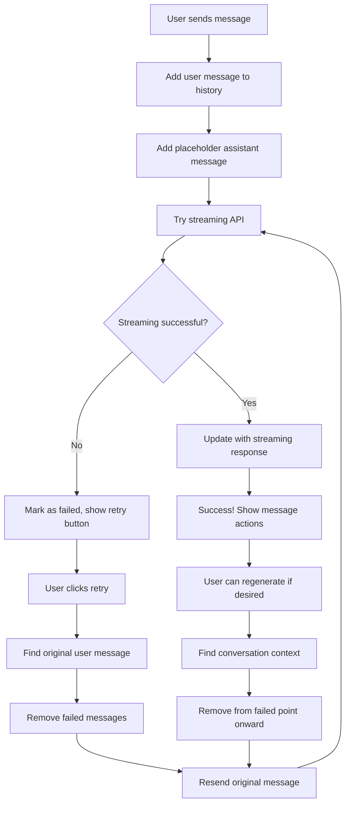

# Advanced Features: Smart Retry Mechanisms

## 🎯 **Learning Objectives**

By the end of this tutorial, you will:
- Understand why retry mechanisms are crucial for production chat applications
- Implement smart retry logic that preserves conversation context
- Handle failed messages with proper user feedback and recovery options
- Build retry functionality that works with both streaming and regular API modes
- Create professional UX patterns for error recovery

## 🤔 **Why Do We Need Retry Mechanisms?**

In real-world applications, things go wrong:

### **Common Failure Scenarios**
```
❌ Network timeout: User's WiFi drops for 2 seconds
❌ Server overload: Orchestrator is processing too many requests  
❌ Agent unavailable: Math agent container crashed
❌ Protocol error: A2A agent returns malformed response
❌ Rate limiting: Too many requests in short time
❌ Authentication expiry: Session token expired
```

### **Bad User Experience Without Retry**
```
User: "What's 2 + 2?"
Bot: ❌ Error: Network request failed. Please try again.
User: 😤 *has to retype the entire message*
```

### **Good User Experience With Smart Retry**
```
User: "What's 2 + 2?"
Bot: ❌ Failed to get response [🔄 Retry] [📋 Copy]
User: *clicks Retry button*  
Bot: ✅ The answer is 4
```

## 🧠 **Smart Retry Strategy**

Our implementation uses a **conversation-aware retry mechanism**:

### **Key Principles**
1. **Preserve User Intent**: Don't make users retype messages
2. **Show Clear Options**: Visible retry and copy buttons
3. **Maintain Context**: Retry from the exact conversation point
4. **Clean Up History**: Remove failed attempts to avoid confusion
5. **Graceful Degradation**: Fall back to regular API if streaming fails

## 🏗️ **Implementation Architecture**



## 🔧 **Core Implementation: Message History Management**

### **Message Structure with Retry Support**
```typescript
// src/types/chat.ts
export interface Message {
  id: string;                    // Unique identifier
  role: 'user' | 'assistant';   // Message type
  content: string;              // Message text
  timestamp: Date;              // When created
  
  // Agent information (for successful responses)
  agentId?: string;
  agentName?: string; 
  protocol?: string;
  confidence?: number;
  reasoning?: string;
  
  // Streaming and error states
  isStreaming?: boolean;        // Currently being streamed
  error?: string;              // Error message if failed
  
  // UI state
  retryCount?: number;         // How many times retried
}
```

### **Finding the Original User Message**
```typescript
// This is the heart of our retry logic
const handleRetryMessage = useCallback(async (messageId: string) => {
  // Find the failed message in our history
  const messageIndex = messages.findIndex(msg => msg.id === messageId);
  if (messageIndex === -1) return;

  const failedMessage = messages[messageIndex];
  
  // Only retry assistant messages (not user messages)
  if (failedMessage.role !== 'assistant') return;

  // Find the user message that this was a response to
  let userMessage: Message | null = null;
  for (let i = messageIndex - 1; i >= 0; i--) {
    if (messages[i].role === 'user') {
      userMessage = messages[i];
      break; // Found the original user message!
    }
  }

  if (!userMessage) {
    console.error('Could not find original user message for retry');
    return;
  }

  // Clean up: Remove all messages from the failed point onward
  setMessages(prev => prev.slice(0, messageIndex));

  // Retry: Send the original user message again
  await handleSendMessage(userMessage.content);
  
}, [messages, handleSendMessage]);
```

### **Why This Approach Works**
1. **Context Preservation**: We find the exact user message that caused the failure
2. **Clean History**: Remove failed attempts so users aren't confused
3. **Automatic Recovery**: System handles the complexity, not the user
4. **Conversation Integrity**: Chat history remains logically consistent

## 🎨 **UI Implementation: Retry Buttons**

### **Failed Message Display**
```typescript
// src/components/Chat/Message.tsx - Error State
{isError ? (
  <div className="space-y-2">
    <div className="text-red-600 dark:text-red-400">
      {message.error}
    </div>
    
    {/* Retry button for error messages */}
    {onRetry && !isUser && (
      <button
        onClick={() => onRetry(message.id)}
        className="flex items-center gap-1 px-2 py-1 text-xs text-red-600 dark:text-red-400 hover:bg-red-50 dark:hover:bg-red-900/20 rounded transition-colors"
      >
        <RotateCcw className="w-3 h-3" />
        Retry
      </button>
    )}
  </div>
) : /* ... normal message display ... */}
```

### **Success Message Actions**
```typescript
// src/components/Chat/Message.tsx - Success State Actions
{/* Message actions for successful messages */}
{!isError && !isStreaming && message.content && (onCopy || (onRetry && !isUser)) && (
  <div className="flex items-center gap-1 mt-2">
    {onCopy && (
      <button
        onClick={() => onCopy(message.content)}
        className="flex items-center gap-1 px-2 py-1 text-xs text-gray-500 hover:text-gray-700 dark:text-gray-400 dark:hover:text-gray-200 hover:bg-gray-100 dark:hover:bg-gray-700 rounded transition-colors"
        title="Copy message"
      >
        <Copy className="w-3 h-3" />
        Copy
      </button>
    )}
    
    {onRetry && !isUser && (
      <button
        onClick={() => onRetry(message.id)}
        className="flex items-center gap-1 px-2 py-1 text-xs text-gray-500 hover:text-gray-700 dark:text-gray-400 dark:hover:text-gray-200 hover:bg-gray-100 dark:hover:bg-gray-700 rounded transition-colors"
        title="Regenerate response"
      >
        <RotateCcw className="w-3 h-3" />
        Regenerate
      </button>
    )}
  </div>
)}
```

## 🔄 **Streaming Fallback Pattern**

Our chat container implements a **graceful fallback strategy**:

```typescript
// src/components/Chat/StreamingChatContainer.tsx
const handleSendMessage = useCallback(async (content: string) => {
  // Clear any previous errors
  clearError();

  // Add user message to history
  const userMessage: Message = {
    id: uuidv4(),
    role: 'user',
    content,
    timestamp: new Date(),
  };
  setMessages(prev => [...prev, userMessage]);

  // Add placeholder assistant message for streaming
  const assistantMessage: Message = {
    id: uuidv4(),
    role: 'assistant', 
    content: '',
    timestamp: new Date(),
    isStreaming: true,
  };
  setMessages(prev => [...prev, assistantMessage]);

  // 🚀 Try streaming first
  try {
    await processMessageStream(content);
    return; // Success! Streaming handled everything
    
  } catch (streamError) {
    console.warn('Streaming failed, falling back to regular API:', streamError);
    
    // 💡 Update UI to show we're falling back
    setMessages(prev => {
      const lastMessage = prev[prev.length - 1];
      if (lastMessage && lastMessage.role === 'assistant') {
        return [
          ...prev.slice(0, -1),
          {
            ...lastMessage,
            content: '⚠️ Streaming unavailable, using standard mode...',
          }
        ];
      }
      return prev;
    });

    // 🔄 Try regular API as fallback
    const response = await regularApi.processMessage(content);
    
    if (response) {
      // Success with regular API!
      setMessages(prev => {
        const lastMessage = prev[prev.length - 1];
        if (lastMessage && lastMessage.role === 'assistant') {
          return [
            ...prev.slice(0, -1),
            {
              ...lastMessage,
              content: response.content || 'No response received',
              agentId: response.agent_id,
              agentName: response.agent_name,
              protocol: response.protocol,
              confidence: response.confidence,
              reasoning: response.reasoning,
              isStreaming: false,
            }
          ];
        }
        return prev;
      });
    }
  }

  // 💥 Both streaming and regular API failed
  if (error) {
    setMessages(prev => {
      const lastMessage = prev[prev.length - 1];
      if (lastMessage && lastMessage.role === 'assistant') {
        return [
          ...prev.slice(0, -1),
          {
            ...lastMessage,
            content: '',
            error: error || 'Failed to process message. Please try again.',
            isStreaming: false,
          }
        ];
      }
      return prev;
    });
  }
}, [processMessageStream, regularApi, error, clearError]);
```

## 🧪 **Advanced Retry Patterns**

### **Exponential Backoff**
For automatic retries (not user-triggered):

```typescript
const retryWithBackoff = async (
  fn: () => Promise<any>, 
  maxRetries = 3,
  baseDelay = 1000
) => {
  for (let attempt = 0; attempt < maxRetries; attempt++) {
    try {
      return await fn();
    } catch (error) {
      if (attempt === maxRetries - 1) throw error;
      
      // Wait longer each time: 1s, 2s, 4s
      const delay = baseDelay * Math.pow(2, attempt);
      await new Promise(resolve => setTimeout(resolve, delay));
    }
  }
};
```

### **Retry with Different Strategies**
```typescript
const smartRetry = async (userMessage: string) => {
  // Strategy 1: Try streaming
  try {
    return await streamingApi.processMessage(userMessage);
  } catch (streamError) {
    
    // Strategy 2: Try regular API
    try {
      return await regularApi.processMessage(userMessage);  
    } catch (apiError) {
      
      // Strategy 3: Try different agent directly
      try {
        return await regularApi.processMessage(userMessage, { forceAgent: 'backup-agent' });
      } catch (backupError) {
        
        // All strategies failed
        throw new Error('All retry strategies exhausted');
      }
    }
  }
};
```

### **Rate Limiting Awareness**
```typescript
const retryWithRateLimit = async (fn: () => Promise<any>) => {
  try {
    return await fn();
  } catch (error) {
    // Check if it's a rate limit error (HTTP 429)
    if (error.response?.status === 429) {
      const retryAfter = error.response.headers['retry-after'];
      const delay = retryAfter ? parseInt(retryAfter) * 1000 : 5000;
      
      // Wait and retry once
      await new Promise(resolve => setTimeout(resolve, delay));
      return await fn();
    }
    throw error; // Re-throw non-rate-limit errors
  }
};
```

## 📱 **Mobile-Friendly Retry UX**

### **Touch-Friendly Buttons**
```typescript
// Larger touch targets for mobile
<button
  onClick={() => onRetry(message.id)}
  className="flex items-center gap-2 px-4 py-2 text-sm text-red-600 hover:bg-red-50 rounded-lg transition-colors min-h-[44px]" // 44px minimum for iOS
>
  <RotateCcw className="w-4 h-4" />
  Retry
</button>
```

### **Swipe-to-Retry (Advanced)**
```typescript
// Using react-swipeable or similar library
const swipeHandlers = useSwipeable({
  onSwipedLeft: () => {
    if (message.error) {
      onRetry(message.id);
    }
  },
  trackMouse: true
});

return (
  <div {...swipeHandlers} className="relative">
    {/* Message content */}
    {message.error && (
      <div className="absolute right-0 top-0 h-full flex items-center px-2 text-gray-400">
        ← Swipe to retry
      </div>
    )}
  </div>
);
```

## 🔍 **Testing Your Retry Implementation**

### **Simulating Failures**
```typescript
// For testing, add a failure rate to your API service
class TestOrchestratorAPI extends OrchestratorAPI {
  private failureRate = 0.3; // 30% failure rate for testing
  
  async processMessage(query: string) {
    // Randomly fail to test retry logic
    if (Math.random() < this.failureRate) {
      throw new Error('Simulated network failure for testing');
    }
    
    return super.processMessage(query);
  }
}
```

### **Testing Scenarios**
1. **Network Failure**: Disconnect WiFi mid-request
2. **Server Error**: Return 500 status from backend
3. **Timeout**: Make requests that take >30 seconds
4. **Malformed Response**: Return invalid JSON
5. **Rate Limiting**: Send many requests quickly

## 🐛 **Common Retry Implementation Issues**

### **Issue 1: Infinite Loops**
```typescript
// ❌ Can cause infinite retries
const handleRetry = async (messageId: string) => {
  const response = await handleSendMessage(originalMessage);
  if (!response) {
    handleRetry(messageId); // 🚨 Infinite loop!
  }
};

// ✅ Add retry limits
const handleRetry = async (messageId: string, retryCount = 0) => {
  if (retryCount >= 3) {
    setError('Maximum retries reached');
    return;
  }
  
  try {
    await handleSendMessage(originalMessage);
  } catch (error) {
    await handleRetry(messageId, retryCount + 1);
  }
};
```

### **Issue 2: State Inconsistency**
```typescript
// ❌ Race condition: User clicks retry multiple times
const handleRetry = async (messageId: string) => {
  setRetrying(true);
  await processMessage();
  setRetrying(false); // State might be inconsistent
};

// ✅ Disable button during retry
<button 
  disabled={isRetrying || isLoading}
  onClick={() => onRetry(message.id)}
>
  {isRetrying ? 'Retrying...' : 'Retry'}
</button>
```

### **Issue 3: Memory Leaks**
```typescript
// ❌ Retry creates new API calls without cleaning up old ones
const retry = () => {
  const eventSource = new EventSource('/stream'); // Old one not closed!
};

// ✅ Always cleanup previous attempts
const retry = () => {
  if (currentEventSource) {
    currentEventSource.close();
  }
  currentEventSource = new EventSource('/stream');
};
```

## 🎯 **Key Takeaways**

1. **Retry is essential for production apps** - Networks and servers fail frequently
2. **Smart retry preserves context** - Find the original user message, don't make users retype
3. **Clean up failed attempts** - Remove failed messages from history to avoid confusion  
4. **Multiple fallback strategies** - Streaming → Regular API → Error with retry button
5. **Professional UX matters** - Clear buttons, loading states, helpful error messages
6. **Test failure scenarios** - Simulate network issues and server errors during development
7. **Mobile considerations** - Touch-friendly buttons and swipe gestures

## 📋 **Next Steps**

In the next tutorial, we'll explore:
- **Message Actions System**: Building copy, regenerate, and custom action buttons
- **Clipboard Integration**: Browser APIs and cross-platform clipboard handling
- **Action Button Management**: Context-aware actions based on message state
- **Keyboard Shortcuts**: Power user features for efficiency

## 🔗 **Helpful Resources**

- [React useCallback Hook](https://react.dev/reference/react/useCallback)
- [Error Boundaries in React](https://react.dev/reference/react/Component#catching-rendering-errors-with-an-error-boundary)
- [HTTP Status Codes](https://developer.mozilla.org/en-US/docs/Web/HTTP/Status)
- [Network Error Handling Best Practices](https://web.dev/reliable/)

---

**Next**: [02-message-actions-system.md](./02-message-actions-system.md) - Building Professional Message Actions

**Previous**: [Phase 3: Streaming Features](../phase-3-streaming/01-understanding-sse.md)