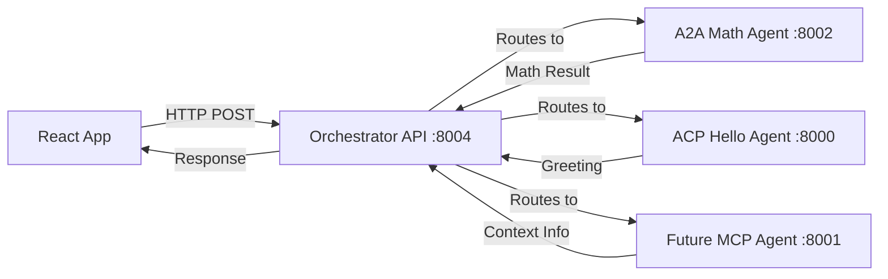

# Phase 2.1: Understanding the Orchestrator API

## 🎯 **Learning Objectives**

By the end of this tutorial, you will:
- Understand the Multi-Protocol Agent Orchestrator API
- Know how to make HTTP requests from React to a backend
- Understand different response formats (A2A, ACP protocols)
- Handle API errors gracefully in React applications
- Set up the foundation for real-time features

## 🔍 **What is the Orchestrator API?**

The **Multi-Protocol Agent Orchestrator** is the brain of our system. It receives user messages and intelligently routes them to the most appropriate agent across different protocols (A2A, ACP, MCP).

### **Key Endpoints We'll Use**
```
GET  /health              - Check if orchestrator is running
GET  /agents              - List all discovered agents  
POST /process             - Send message and get response
POST /process/stream      - Same as /process but with streaming (Phase 3)
```

## 🏗️ **API Architecture Overview**



## 📊 **Understanding API Responses**

### **Health Check Response**
```typescript
// GET /health
{
  "status": "healthy",
  "agents_discovered": 2,
  "timestamp": "2024-08-12T10:30:00Z"
}
```

### **Agents List Response**
```typescript  
// GET /agents
[
  {
    "agent_id": "a2a-math",
    "name": "Math Agent",
    "protocol": "a2a",
    "endpoint": "http://a2a-math-agent:8002",
    "status": "healthy",
    "capabilities": [
      {
        "name": "basic arithmetic", 
        "tags": ["math", "arithmetic", "calculation"]
      }
    ]
  },
  {
    "agent_id": "acp-greeting-agent",
    "name": "Greeting Agent",
    "protocol": "acp", 
    "endpoint": "http://greeting-agent:8000",
    "status": "healthy",
    "capabilities": [
      {
        "name": "greeting",
        "tags": ["greeting", "hello", "welcome"]
      }
    ]
  }
]
```

### **Process Response (The Important One!)**
```typescript
// POST /process
{
  "request_id": "req_12345",
  "agent_id": "a2a-math", 
  "agent_name": "Math Agent",
  "protocol": "a2a",
  "content": "The answer is 7",        // ← This is what we display!
  "confidence": 0.95,
  "reasoning": "User asked for 3+4, which is basic arithmetic. Math agent handles this perfectly.",
  "response_data": {             // ← Raw protocol response
    "raw_response": {
      "parts": [
        {
          "kind": "text", 
          "text": "The answer is 7"
        }
      ]
    }
  },
  "success": true,
  "duration_ms": 1200,
  "timestamp": "2024-08-12T10:30:15Z"
}
```

## 🔧 **Setting Up API Communication in React**

### **Step 1: Create the Service Layer**

We don't make API calls directly in components. Instead, we create a **service layer**:

```typescript
// src/services/orchestratorApi.ts

class OrchestratorAPI {
  private baseUrl = 'http://localhost:8004';

  // Check if orchestrator is running
  async checkHealth() {
    const response = await fetch(`${this.baseUrl}/health`);
    if (!response.ok) {
      throw new Error(`Health check failed: ${response.status}`);
    }
    return response.json();
  }

  // Get list of available agents
  async getAgents() {
    const response = await fetch(`${this.baseUrl}/agents`);
    if (!response.ok) {
      throw new Error(`Failed to fetch agents: ${response.status}`);
    }
    return response.json();
  }

  // Send message to orchestrator
  async processMessage(query: string) {
    const response = await fetch(`${this.baseUrl}/process`, {
      method: 'POST',
      headers: {
        'Content-Type': 'application/json',
      },
      body: JSON.stringify({ query }),
    });

    if (!response.ok) {
      throw new Error(`Failed to process message: ${response.status}`);
    }

    return response.json();
  }
}

// Export a singleton instance
export const orchestratorApi = new OrchestratorAPI();
```

### **Why This Pattern?**

1. **Separation of Concerns**: API logic is separate from UI logic
2. **Reusability**: Multiple components can use the same API methods
3. **Testability**: Easy to mock for testing
4. **Error Handling**: Centralized error handling strategy
5. **Type Safety**: Can add TypeScript interfaces for responses

## 🎭 **Protocol-Aware Response Parsing**

Different agents return data in different formats. Our API service needs to handle this:

```typescript
// This is the tricky part - different protocols format responses differently!

public extractResponseContent(data: any): string {
  const responseData = data.response_data;
  const protocol = data.protocol?.toLowerCase();
  
  // A2A Protocol: Uses "parts" array
  if (protocol === 'a2a' && responseData.raw_response?.parts?.length > 0) {
    const textParts = responseData.raw_response.parts
      .filter((part: any) => part.kind === 'text' || !part.kind)
      .map((part: any) => part.text)
      .filter(Boolean);
    
    if (textParts.length > 0) {
      return textParts.join(' ').trim();
    }
  }
  
  // ACP Protocol: Uses direct response format
  if (protocol === 'acp') {
    if (responseData.content) {
      return responseData.content;
    }
    if (responseData.response && typeof responseData.response === 'string') {
      return responseData.response;
    }
  }
  
  // Fallback: Try to find any text content
  if (data.content && typeof data.content === 'string') {
    return data.content;
  }
  
  return 'No response content available';
}
```

## 🛠️ **Your First API Integration**

Let's build a simple component that fetches and displays agents:

```typescript
// src/components/AgentList.tsx
import React, { useState, useEffect } from 'react';
import { orchestratorApi } from '../services/orchestratorApi';

interface Agent {
  agent_id: string;
  name: string;
  protocol: string;
  status: string;
}

export const AgentList: React.FC = () => {
  const [agents, setAgents] = useState<Agent[]>([]);
  const [loading, setLoading] = useState(true);
  const [error, setError] = useState<string | null>(null);

  useEffect(() => {
    const loadAgents = async () => {
      try {
        setLoading(true);
        setError(null);
        
        // Make API call
        const agentData = await orchestratorApi.getAgents();
        setAgents(agentData);
        
      } catch (err) {
        // Handle errors gracefully
        const errorMessage = err instanceof Error ? err.message : 'Failed to load agents';
        setError(errorMessage);
        console.error('Failed to load agents:', err);
        
      } finally {
        setLoading(false);
      }
    };

    loadAgents();
  }, []);

  // Loading state
  if (loading) {
    return (
      <div className="flex items-center justify-center p-4">
        <div className="animate-spin w-6 h-6 border-2 border-blue-500 border-t-transparent rounded-full" />
        <span className="ml-2">Loading agents...</span>
      </div>
    );
  }

  // Error state  
  if (error) {
    return (
      <div className="bg-red-50 border border-red-200 rounded-lg p-4">
        <p className="text-red-700">Error: {error}</p>
        <button 
          onClick={() => window.location.reload()} 
          className="mt-2 px-3 py-1 bg-red-600 text-white rounded hover:bg-red-700"
        >
          Retry
        </button>
      </div>
    );
  }

  // Success state - display agents
  return (
    <div className="space-y-2">
      <h3 className="text-lg font-semibold">Available Agents ({agents.length})</h3>
      {agents.map((agent) => (
        <div key={agent.agent_id} className="border rounded-lg p-3">
          <div className="flex items-center justify-between">
            <span className="font-medium">{agent.name}</span>
            <span className={`px-2 py-1 rounded text-xs ${
              agent.status === 'healthy' ? 'bg-green-100 text-green-700' : 'bg-red-100 text-red-700'
            }`}>
              {agent.status}
            </span>
          </div>
          <div className="text-sm text-gray-600 mt-1">
            {agent.protocol.toUpperCase()} • {agent.agent_id}
          </div>
        </div>
      ))}
    </div>
  );
};
```

## 🧪 **Try It Yourself**

### **Exercise 1: Health Check Component**
Create a component that:
1. Shows a green dot when orchestrator is healthy
2. Shows a red dot when orchestrator is down
3. Updates every 30 seconds
4. Displays the number of discovered agents

### **Exercise 2: Message Sender**
Create a component that:
1. Has a text input and send button
2. Sends message to `/process` endpoint
3. Displays the response content
4. Shows loading state during request
5. Handles errors gracefully

### **Exercise 3: Protocol Badge**
Create a reusable component that:
1. Takes a protocol name as prop
2. Displays a colored badge (A2A = blue, ACP = green)
3. Shows protocol version if available
4. Has hover tooltips explaining each protocol

## 🐛 **Common API Integration Issues**

### **Issue 1: CORS Errors**
```
Access to fetch at 'http://localhost:8004/health' from origin 'http://localhost:5173' has been blocked by CORS policy
```

**Solution**: Orchestrator includes CORS headers, but if you see this:
1. Check that orchestrator is running on port 8004
2. Verify you're using the correct URL in your API service
3. Check browser network tab for actual HTTP status

### **Issue 2: Network Errors**
```
TypeError: fetch failed
```

**Solution**: This usually means the orchestrator isn't running:
1. Start orchestrator: `docker-compose up -d orchestrator`
2. Check health: `curl http://localhost:8004/health`
3. Check firewall/antivirus blocking connections

### **Issue 3: Empty/Undefined Responses**
```typescript
// response.json() returns undefined or empty object
```

**Solution**: Check the actual HTTP response:
1. Open browser Network tab
2. Look for the API request
3. Check response status and body
4. Verify Content-Type headers

### **Issue 4: TypeScript Errors with JSON**
```typescript
// Object is of type 'unknown'
const data = await response.json(); // TypeScript complains
```

**Solution**: Define interfaces for your API responses:
```typescript
interface HealthResponse {
  status: string;
  agents_discovered: number;
  timestamp: string;
}

const data: HealthResponse = await response.json();
```

## 📋 **Next Steps**

In the next tutorial, we'll:
1. **Build the Service Layer Architecture** - Create a robust API service with error handling
2. **Implement Custom Hooks** - Create `useOrchestrator` hook for state management
3. **Add Loading States** - Professional loading indicators and error boundaries
4. **Protocol Parsing** - Handle A2A and ACP response formats correctly

## 🔍 **Key Takeaways**

1. **APIs are just HTTP endpoints** - Use fetch() or axios to communicate
2. **Always handle errors** - Networks fail, servers crash, users go offline
3. **Separate concerns** - Keep API logic out of components  
4. **Different protocols, different formats** - Parse responses based on protocol
5. **Loading states matter** - Users need feedback during requests
6. **Type safety helps** - TypeScript catches API integration bugs early

## 🔗 **Helpful Resources**

- [MDN Fetch API](https://developer.mozilla.org/en-US/docs/Web/API/Fetch_API)
- [React useEffect Hook](https://react.dev/reference/react/useEffect)
- [TypeScript Interfaces](https://www.typescriptlang.org/docs/handbook/interfaces.html)
- [HTTP Status Codes](https://developer.mozilla.org/en-US/docs/Web/HTTP/Status)

---

**Next**: [02-service-layer-architecture.md](./02-service-layer-architecture.md) - Building Robust API Services

**Previous**: [Phase 1: Building Chat UI](../phase-1-basics/07-building-chat-ui.md)