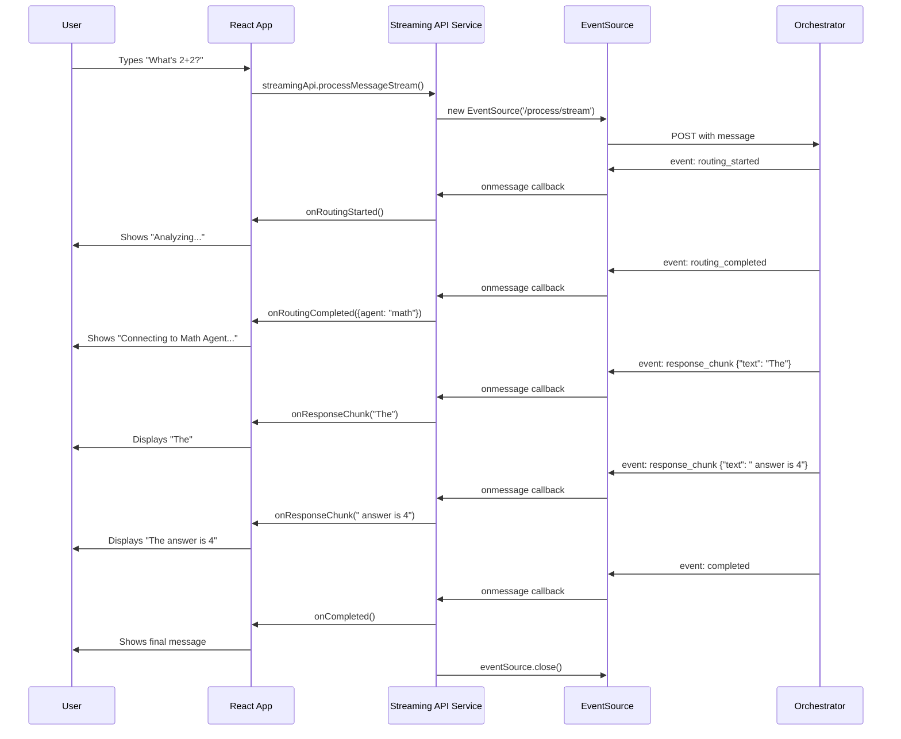

# Phase 3.1: Understanding Server-Sent Events (SSE)

## 🎯 **Learning Objectives**

By the end of this tutorial, you will:
- Understand what Server-Sent Events (SSE) are and why they're better than polling
- Know the difference between SSE, WebSockets, and regular HTTP requests
- Implement basic SSE in JavaScript/React
- Handle SSE connection management and error recovery
- Build the foundation for real-time chat streaming

## 🚀 **What Are Server-Sent Events?**

**Server-Sent Events (SSE)** allow a server to push data to a web browser in real-time over a single HTTP connection. Unlike WebSockets, SSE is **one-way communication** (server → browser) and much simpler to implement.

### **Perfect for Chat Applications**
```
Traditional Approach:
User sends message → Wait... → Complete response arrives at once

SSE Streaming Approach:  
User sends message → "Analyzing..." → "Connecting to Math Agent..." → "The" → "answer" → "is" → "42"
```

## 🤔 **Why Use SSE Instead of Alternatives?**

### **SSE vs Regular HTTP Requests**
```typescript
// ❌ Regular HTTP: Wait for complete response
const response = await fetch('/api/chat', { 
  method: 'POST', 
  body: JSON.stringify({ message: "What's 2+2?" }) 
});
const data = await response.json();
console.log(data); // Complete response after 3-5 seconds

// ✅ SSE: Get response chunks as they arrive
const eventSource = new EventSource('/api/chat/stream');
eventSource.onmessage = (event) => {
  console.log('Chunk:', event.data); // Updates in real-time!
};
```

### **SSE vs WebSockets**
| Feature | SSE | WebSockets |
|---------|-----|------------|
| **Complexity** | Simple | Complex |
| **Direction** | Server → Client | Bidirectional | 
| **Reconnection** | Automatic | Manual |
| **Proxy Support** | Excellent | Can be problematic |
| **HTTP Caching** | Works | Doesn't apply |
| **Use Case** | Live updates, streaming | Real-time gaming, collaboration |

**For chat applications, SSE is usually the better choice!**

## 🛠️ **Basic SSE Implementation**

### **Server Side (FastAPI Example)**
```python
# This is what our orchestrator does internally
from fastapi import FastAPI
from fastapi.responses import StreamingResponse
import json

app = FastAPI()

@app.post("/process/stream")
async def stream_response(request: ChatRequest):
    async def generate_events():
        # Send initial event
        yield f"data: {json.dumps({'event': 'routing_started'})}\n\n"
        
        # Send routing decision
        routing_info = {"event": "routing_completed", "agent": "math", "confidence": 0.95}
        yield f"data: {json.dumps(routing_info)}\n\n"
        
        # Send response chunks as they arrive from agent
        async for chunk in agent.stream_response():
            chunk_event = {"event": "response_chunk", "text": chunk}
            yield f"data: {json.dumps(chunk_event)}\n\n"
        
        # Send completion
        yield f"data: {json.dumps({'event': 'completed'})}\n\n"
    
    return StreamingResponse(generate_events(), media_type="text/plain")
```

### **Client Side (JavaScript)**
```typescript
// Basic SSE client implementation
const eventSource = new EventSource('/process/stream');

eventSource.onopen = () => {
  console.log('SSE connection opened');
};

eventSource.onmessage = (event) => {
  const data = JSON.parse(event.data);
  
  switch (data.event) {
    case 'routing_started':
      console.log('🧠 Analyzing your request...');
      break;
    case 'routing_completed':
      console.log(`🎯 Routing to ${data.agent} (${data.confidence * 100}% confidence)`);
      break;
    case 'response_chunk':
      console.log(`📝 ${data.text}`);
      break;  
    case 'completed':
      console.log('✅ Done!');
      eventSource.close();
      break;
  }
};

eventSource.onerror = (error) => {
  console.error('SSE error:', error);
  eventSource.close();
};
```

## ⚡ **SSE in React: The Right Way**

### **Problem: SSE in React is Tricky**
```typescript
// ❌ DON'T DO THIS - Will create new EventSource on every render!
const ChatComponent = () => {
  const [message, setMessage] = useState('');
  
  const eventSource = new EventSource('/stream'); // 🚨 Bug!
  
  eventSource.onmessage = (event) => {
    setMessage(event.data);
  };
  
  return <div>{message}</div>;
};
```

### **✅ Correct Approach: useEffect + Cleanup**
```typescript
const ChatComponent = () => {
  const [message, setMessage] = useState('');
  const [isConnected, setIsConnected] = useState(false);

  useEffect(() => {
    // Create EventSource only once
    const eventSource = new EventSource('/stream');
    
    eventSource.onopen = () => {
      setIsConnected(true);
    };
    
    eventSource.onmessage = (event) => {
      setMessage(event.data);
    };
    
    eventSource.onerror = () => {
      setIsConnected(false);
    };
    
    // 🔧 CRITICAL: Cleanup on unmount
    return () => {
      eventSource.close();
    };
  }, []); // Empty dependency array = run once

  return (
    <div>
      <div>Status: {isConnected ? '🟢 Connected' : '🔴 Disconnected'}</div>
      <div>Message: {message}</div>
    </div>
  );
};
```

## 🏗️ **Our Streaming Architecture**

Here's how streaming works in our chat application:



## 🎭 **Event Types in Our Implementation**

Our orchestrator sends different event types during processing:

```typescript
// Event structure that our orchestrator sends
interface StreamEvent {
  event: 'routing_started' | 'routing_completed' | 'agent_execution_started' | 'response_chunk' | 'completed' | 'error';
  data?: any;
}

// Example events you'll see:
{
  "event": "routing_started"
}

{
  "event": "routing_completed",
  "agent_id": "a2a-math",
  "agent_name": "Math Agent", 
  "protocol": "a2a",
  "confidence": 0.95,
  "reasoning": "User asked for arithmetic, math agent is perfect for this."
}

{
  "event": "response_chunk", 
  "response_data": {
    "raw_response": {
      "parts": [{"kind": "text", "text": "The answer is "}]
    }
  },
  "protocol": "a2a"
}

{
  "event": "completed",
  "agent_id": "a2a-math",
  "protocol": "a2a",
  "response_data": { /* full response */ }
}
```

## 🔧 **Building a Simple Streaming Component**

Let's build a component that demonstrates SSE streaming:

```typescript
// src/components/StreamingDemo.tsx
import React, { useState, useEffect, useRef } from 'react';

export const StreamingDemo: React.FC = () => {
  const [events, setEvents] = useState<string[]>([]);
  const [isStreaming, setIsStreaming] = useState(false);
  const eventSourceRef = useRef<EventSource | null>(null);

  const startStream = () => {
    // Don't start if already streaming
    if (eventSourceRef.current) return;
    
    setIsStreaming(true);
    setEvents([]);
    
    // Create EventSource for streaming
    const eventSource = new EventSource('http://localhost:8004/process/stream');
    eventSourceRef.current = eventSource;
    
    eventSource.onopen = () => {
      setEvents(prev => [...prev, '🟢 Connected to stream']);
    };
    
    eventSource.onmessage = (event) => {
      try {
        const data = JSON.parse(event.data);
        const message = `📡 ${data.event}: ${JSON.stringify(data, null, 2)}`;
        setEvents(prev => [...prev, message]);
        
        // Close stream when completed
        if (data.event === 'completed' || data.event === 'error') {
          eventSource.close();
          eventSourceRef.current = null;
          setIsStreaming(false);
        }
      } catch (err) {
        setEvents(prev => [...prev, `❌ Failed to parse: ${event.data}`]);
      }
    };
    
    eventSource.onerror = (error) => {
      setEvents(prev => [...prev, `🔴 Stream error: ${error}`]);
      eventSource.close();
      eventSourceRef.current = null;
      setIsStreaming(false);
    };
  };
  
  const stopStream = () => {
    if (eventSourceRef.current) {
      eventSourceRef.current.close();
      eventSourceRef.current = null;
      setIsStreaming(false);
      setEvents(prev => [...prev, '🛑 Stream stopped by user']);
    }
  };
  
  // Cleanup on unmount
  useEffect(() => {
    return () => {
      if (eventSourceRef.current) {
        eventSourceRef.current.close();
      }
    };
  }, []);

  return (
    <div className="max-w-2xl mx-auto p-6 bg-white rounded-lg shadow">
      <h2 className="text-xl font-bold mb-4">SSE Streaming Demo</h2>
      
      <div className="flex gap-2 mb-4">
        <button 
          onClick={startStream}
          disabled={isStreaming}
          className="px-4 py-2 bg-blue-500 text-white rounded hover:bg-blue-600 disabled:opacity-50"
        >
          {isStreaming ? 'Streaming...' : 'Start Stream'}
        </button>
        
        <button 
          onClick={stopStream}
          disabled={!isStreaming}
          className="px-4 py-2 bg-red-500 text-white rounded hover:bg-red-600 disabled:opacity-50"
        >
          Stop Stream
        </button>
      </div>
      
      <div className="bg-gray-900 text-green-400 p-4 rounded font-mono text-sm h-96 overflow-y-auto">
        {events.length === 0 ? (
          <div className="text-gray-500">Click "Start Stream" to begin...</div>
        ) : (
          events.map((event, index) => (
            <div key={index} className="mb-1">
              [{new Date().toLocaleTimeString()}] {event}
            </div>
          ))
        )}
      </div>
    </div>
  );
};
```

## 🧪 **Try It Yourself**

### **Exercise 1: Connection Status**
Modify the `StreamingDemo` to show:
- 🟢 Connected and ready
- 🟡 Connecting...  
- 🔴 Connection failed
- ⚫ Not connected

### **Exercise 2: Event Counter**
Add counters that show:
- Total events received
- Events per second
- Connection uptime

### **Exercise 3: Message Accumulator** 
Create a component that:
- Accumulates `response_chunk` events into a single message
- Shows typing indicator during streaming  
- Displays the final complete message

## 🐛 **Common SSE Issues & Solutions**

### **Issue 1: EventSource Not Closing**
```typescript
// ❌ Causes memory leaks
useEffect(() => {
  const eventSource = new EventSource('/stream');
  eventSource.onmessage = handleMessage;
  // Missing cleanup!
}, []);

// ✅ Always cleanup
useEffect(() => {
  const eventSource = new EventSource('/stream');  
  eventSource.onmessage = handleMessage;
  
  return () => {
    eventSource.close(); // 🔧 Critical!
  };
}, []);
```

### **Issue 2: Browser Connection Limits**
Browsers limit EventSource connections to 6 per domain. If you open many tabs:

```typescript
// Check if already connected before creating new EventSource
if (eventSourceRef.current?.readyState === EventSource.OPEN) {
  console.log('Already connected');
  return;
}
```

### **Issue 3: CORS Issues with Credentials**
```typescript
// If your backend requires authentication
const eventSource = new EventSource('/stream', {
  withCredentials: true
});
```

### **Issue 4: Automatic Reconnection**
EventSource automatically reconnects, but you might want custom logic:

```typescript
eventSource.onerror = (error) => {
  console.log('Connection lost, will retry...');
  // EventSource automatically retries with exponential backoff
  // You can close() and create new one for custom retry logic
};
```

## 📊 **Performance Considerations**

### **Memory Usage**
```typescript
// 🚨 Each event creates new array - expensive for many events!
setEvents(prev => [...prev, newEvent]);

// ✅ Better: Limit history size
setEvents(prev => {
  const newEvents = [...prev, newEvent];
  return newEvents.length > 1000 ? newEvents.slice(-1000) : newEvents;
});
```

### **UI Updates**
```typescript
// 🚨 Every chunk triggers re-render
const [accumulatedText, setAccumulatedText] = useState('');

// ✅ Better: Use useRef for intermediate values
const accumulatedRef = useRef('');
const [displayText, setDisplayText] = useState('');

// Update ref immediately (no re-render)
accumulatedRef.current += chunk;

// Update display less frequently  
const updateDisplay = useCallback(
  debounce(() => setDisplayText(accumulatedRef.current), 100),
  []
);
```

## 🎯 **Key Takeaways**

1. **SSE is perfect for one-way real-time updates** like chat streaming
2. **Always cleanup EventSource** in React useEffect return function
3. **Use useRef for EventSource** to prevent recreation on re-renders
4. **Handle connection errors gracefully** - networks fail frequently
5. **Limit memory usage** for long-running streams
6. **SSE automatically reconnects** with exponential backoff

## 📋 **Next Steps**

In the next tutorial, we'll build the complete streaming API service that:
- Handles all event types from our orchestrator
- Provides clean callbacks for React components
- Manages connection state and error recovery
- Parses protocol-specific response chunks
- Integrates with our existing message components

## 🔗 **Helpful Resources**

- [MDN Server-Sent Events](https://developer.mozilla.org/en-US/docs/Web/API/Server-sent_events)
- [EventSource API Reference](https://developer.mozilla.org/en-US/docs/Web/API/EventSource)
- [HTML5 SSE Specification](https://html.spec.whatwg.org/multipage/server-sent-events.html)
- [SSE vs WebSocket Comparison](https://ably.com/blog/websockets-vs-sse)

---

**Next**: [02-streaming-api-service.md](./02-streaming-api-service.md) - Building the Complete Streaming Service

**Previous**: [Phase 2: API Integration](../phase-2-api-integration/01-orchestrator-api-basics.md)